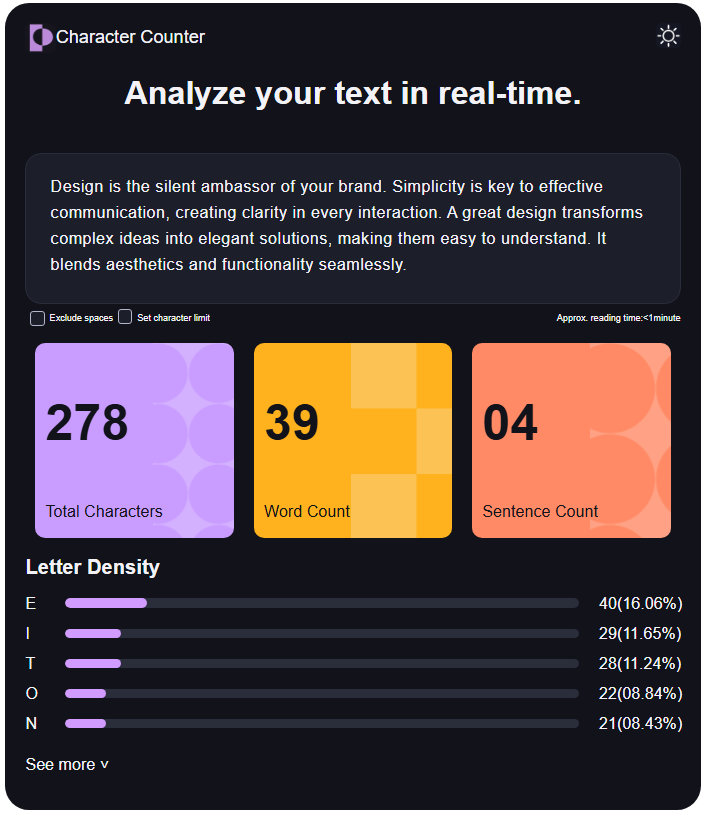

# Proyecto contador de caracteres UTN 

Este proyecto es para la diplomatura Full stack (front end) UTN
Para correrlo simplemente hay que clonarlo y en la misma carpeta correr npm run dev

#Vista previa
